# Zeds
## Base game

Every zed from the [wiki](https://wiki.killingfloor2.com/index.php?title=Specimens_(Killing_Floor_2)) is present. They can be found using the aliases from the `zeds.py` file is unsure about their name.

## Zed varient

All images are from the mod's [workshop page](https://steamcommunity.com/sharedfiles/filedetails/?id=938683482)

### Small zeds

#### Prowler

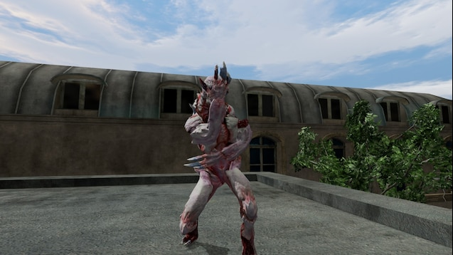

#### Magma clot

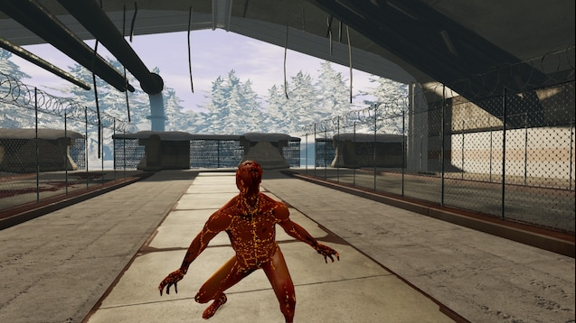

#### Honey biscuit

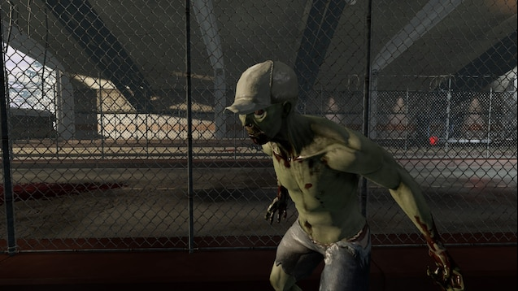

- Has a large healthpool for a clot, still dies fairly fast
- And no, I do not know where the name 'honeybiscuit' comes from, but I wish I did

#### Demonic Clot

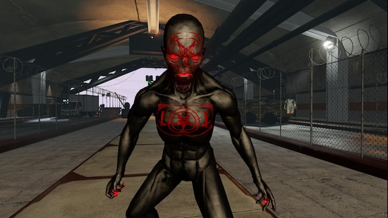

- The current version of ZedVarients does not seem to have them

#### Mr Pelvis

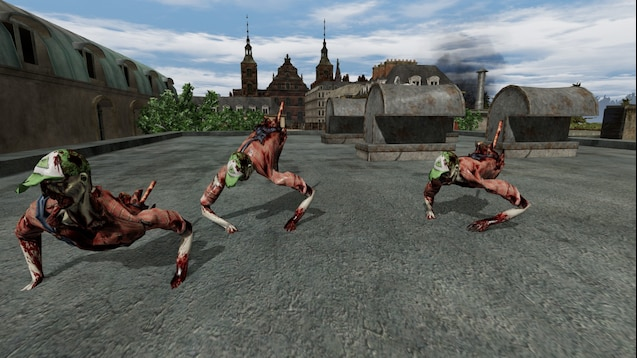

#### Dark creep

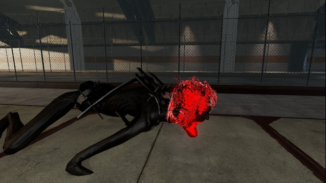

- Surprisingly, it is a siren body using crawlers animations

### Medium zeds

#### Blue husk

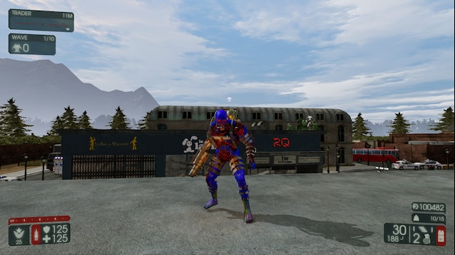

#### Red husk

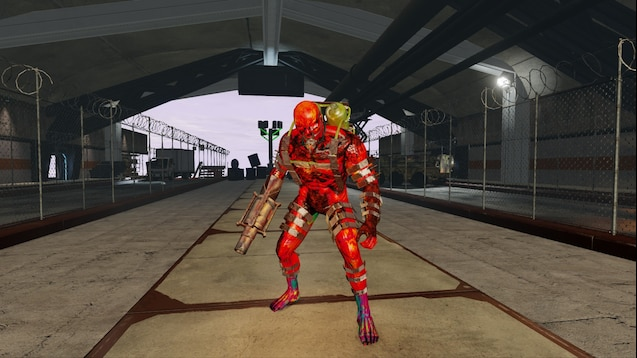

- Is blazingly fast and loves to kill the party via self-destruction

#### Shocktroop

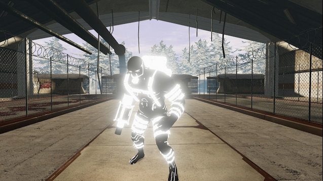

#### Hellfire

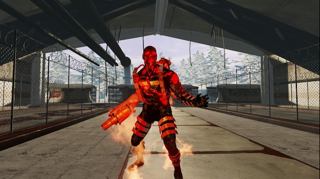

- Shoots a 'slow' moving beam of fire that deals a very high amount of damage when too close

#### Sparky

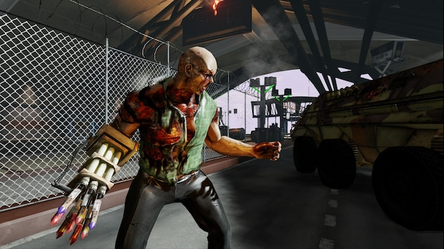

#### Revenant

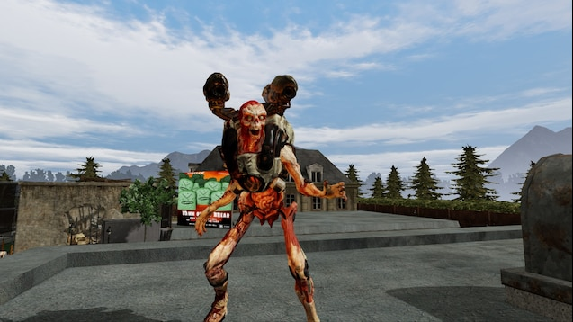

- From Doom
- Husk variant

### Large zeds

#### Blue scrake

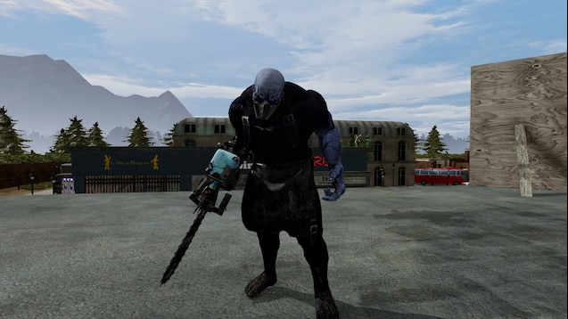

- Has a giant healthpool, but still dies fairly fast when it's missing its head
- Somewhat dumb and manage to get stuck in the spawn zones often enough to be annoying

#### Red Scrake

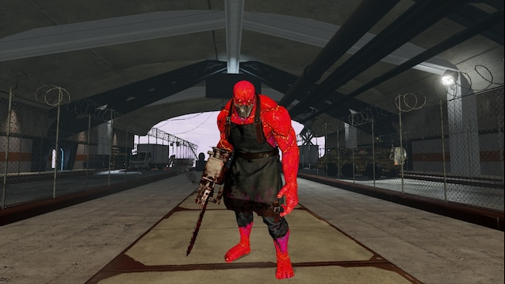

#### Red fleshpound

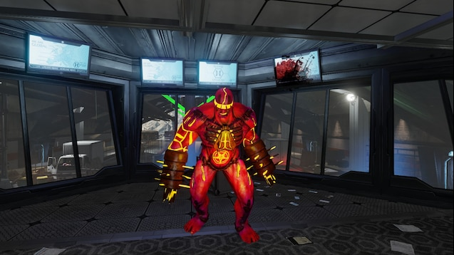

#### Baron of Hell

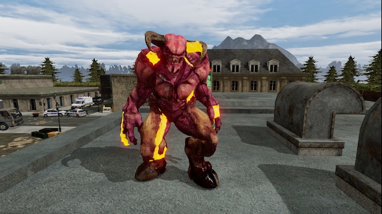

- From Doom
- Fleshpound variant with more damage and health

#### Mancubus

- From Doom
- Husk variant, but much more dangerous
- Unlike the other husks variants, does not fit in medium category...
- Image from the [wiki](https://doom.fandom.com/wiki/Mancubus/Doom_Eternal) since it is missing from the workshop

